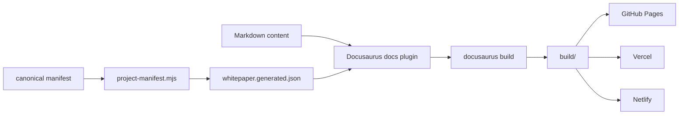

# Docusaurus 可选集成

仅在用户明确选择 Docusaurus，或现有项目需要把 canonical manifest + Markdown 快速发布为静态开发者文档站时使用。Docusaurus 是**渲染与发布层**，不是白皮书事实源；内容、版本、导航和来源锁仍由 canonical manifest 与正文 Markdown 维护。

## 设计目标

- 不改变现有 Markdown 写作与证据链；
- 从 canonical manifest 投影 Docusaurus 文档范围和 Sidebar，避免第二份手工导航；
- 本地 `npm run build` 可以独立验收，部署不是构建成功的前提；
- GitHub Pages、Vercel、Netlify 作为可选发布目标，互不改变白皮书内容；
- 不把 Docusaurus 的 `versioned_docs/` 反向升级为新的事实源。

当前模板按 Docusaurus 3.10.x 验证，Node.js 使用 20+。创建新站点前仍应核对 Docusaurus 官方当前要求，并让目标项目自己的 lockfile 固定实际依赖版本。



## 目录建议

默认把站点放在业务仓库内的独立目录，避免把 Docusaurus 配置混进正文目录：

```text
repo/
├── manifests/
│   └── whitepaper.json
├── docs/                         # 或 manifest 中的 content_root
├── website/
│   └── whitepaper/
│       ├── docusaurus.config.js
│       ├── sidebars.js
│       ├── whitepaper.generated.json   # 生成文件，不手工维护
│       ├── scripts/
│       │   └── project-manifest.mjs
│       ├── src/
│       └── package.json
└── .github/workflows/
```

已有 Docusaurus、monorepo 或其他站点布局时沿用现有目录，不为了使用本模板迁移工程结构。

## 初始化

新站点可以从官方 classic 模板开始：

```bash
npx create-docusaurus@latest website/whitepaper classic
cd website/whitepaper
```

白皮书含 Mermaid 时，为站点安装与当前 Docusaurus core 相同主版本的 `@docusaurus/theme-mermaid`。不要在 Skill 仓库内锁死目标项目最终依赖版本；实际版本由目标仓库的 `package.json` 与 lockfile 固定。

然后从 `assets/docusaurus/` 复制或按现有站点改写：

- `docusaurus.config.js`
- `sidebars.js`
- `scripts/project-manifest.mjs`
- 需要的部署配置

在目标站点 `package.json` 中增加 manifest 投影步骤，例如：

```json
{
  "scripts": {
    "whitepaper:project": "node scripts/project-manifest.mjs --manifest ../../manifests/whitepaper.json --root ../.. --site-dir .",
    "prestart": "npm run whitepaper:project",
    "prebuild": "npm run whitepaper:project"
  }
}
```

如果项目已有 `prestart` / `prebuild`，把投影命令合并进去，不覆盖原有逻辑。

## Manifest 投影

`assets/docusaurus/scripts/project-manifest.mjs` 做三件事：

1. 选择 `--version` 指定的版本；未指定时使用 `policy.default_version`；
2. 从该版本的 `content_root`、`groups`、`articles` 生成 Docusaurus `docs.path`、`include` 与 Sidebar；
3. 写出 `whitepaper.generated.json`，供 `docusaurus.config.js` 与 `sidebars.js` 消费。

示例：

```bash
node scripts/project-manifest.mjs \
  --manifest ../../manifests/whitepaper.json \
  --root ../.. \
  --site-dir . \
  --version v1.2.0
```

生成文件属于**投影结果**。导航顺序、文章标题、正文范围应改 manifest 后重新生成，不直接编辑 `whitepaper.generated.json`。

投影器只把 manifest 注册的 Markdown / MDX 文件放入 `include`，避免同一 `content_root` 下未注册的草稿自动暴露为站点页面。若文章 frontmatter 显式声明了 `id`，投影器会优先使用该 ID；否则使用相对文件路径去掉扩展名后的 Docusaurus 默认 ID。

## Docusaurus 配置边界

模板配置遵循以下约定：

- `docs.path` 来自 manifest 的 `content_root`；
- `routeBasePath: '/'`，白皮书可以直接作为站点主体；已有主站时可改为 `whitepaper`、`docs` 等路径；
- `sidebarPath` 指向 `sidebars.js`，后者只读取生成文件；
- `include` 只包含 manifest 注册文章；
- `onBrokenLinks: 'throw'`，生产构建发现普通坏链直接失败；
- Markdown 链接先使用当前 Docusaurus `markdown.hooks` 配置，不继续采用已弃用的顶层 `onBrokenMarkdownLinks`；
- Mermaid、搜索、分析、多语言、主题都属于可选站点能力，不能改变内容核验状态。

正文引用的本地图片、下载文件或其他静态资产必须在 Docusaurus 构建时可解析。`asset_root` 在 `content_root` 外时，根据现有工程选择相对引用、复制到 `static/` 或构建前同步；不要为了通过构建修改证据路径含义。

## 版本策略

默认集成是**一次构建一个 manifest 版本**。这能保持来源锁清晰，也避免 Docusaurus 自带的 `versioned_docs/` 成为第二套长期维护内容。

需要在线版本切换时有两种方式：

1. **生成式 Docusaurus versioning**：从 manifest 各版本生成 Docusaurus 版本快照；生成目录视为构建产物，不手工编辑；
2. **多站点 / 多路径构建**：CI 对 manifest 中选定版本分别构建到版本路径，再由站点入口提供版本选择。

无论哪种方式，版本是否发布、默认版本、来源 commit 与文章集合仍以 canonical manifest 为准。不要直接执行 `docusaurus docs:version` 后把复制出的正文当成新的维护源。

## 本地验收

至少执行：

```bash
npm ci
npm run build
npm run serve
```

验收重点：

- `whitepaper.generated.json` 的版本、文章集合和 Sidebar 与 manifest 一致；
- `npm run build` 成功并产生 `build/`；
- 深链接刷新可用；
- Mermaid、图片和相对 Markdown 链接可解析；
- GitHub Pages 的子路径部署没有资源 404；
- 未选择部署目标时，本地构建仍然完整可用。

构建通过只证明站点工程可生成，不代表文章事实已经通过来源核验。

## GitHub Pages

复制 `assets/docusaurus/github-pages.yml` 到目标仓库 `.github/workflows/whitepaper-pages.yml`，按实际站点目录调整 `DOCUSAURUS_DIR`。模板使用 Pages artifact + `actions/deploy-pages`，不要求维护 `gh-pages` 分支。

模板设置 `DEPLOY_TARGET=github-pages`。`docusaurus.config.js` 会根据 `GITHUB_REPOSITORY` 自动区分：

- `owner/owner.github.io`：`baseUrl=/`
- 普通项目仓库：`baseUrl=/<repo>/`

自定义域名时显式设置：

```text
SITE_URL=https://docs.example.com
BASE_URL=/
```

首次启用仍需在仓库 Pages 设置中选择 GitHub Actions 作为发布来源。

## Vercel

把 `assets/docusaurus/vercel.json` 放到 Docusaurus 站点根目录，在 Vercel 项目中将 Root Directory 指向该目录。默认：

```text
Build Command     npm run build
Output Directory  build
```

建议为生产环境设置 `SITE_URL`。Preview Deployment 可以继续使用 `/` 作为 `BASE_URL`，不要把 GitHub Pages 的仓库子路径配置带到 Vercel。

## Netlify

把 `assets/docusaurus/netlify.toml` 放到 Docusaurus 站点根目录，在 Netlify 将 Base directory 指向该目录。模板使用：

```text
Build Command     npm run build
Publish Directory build
Node              20
```

生产域名确定后设置 `SITE_URL`；若部署到域名根路径，保持 `BASE_URL=/`。

## 交付记录

启用本集成时，在项目交付记录里至少写清：

- Docusaurus 站点目录；
- canonical manifest 路径与构建版本选择方式；
- 本地构建命令及实际结果；
- 是否配置部署，部署目标是哪一个；
- `SITE_URL` / `BASE_URL` 是否需要环境覆盖；
- 未验证的外链、资产、Preview 或自定义域名项。

没有得到部署授权时，只提交可构建配置和部署模板，不替用户创建外部 Vercel / Netlify 项目或修改托管平台设置。
